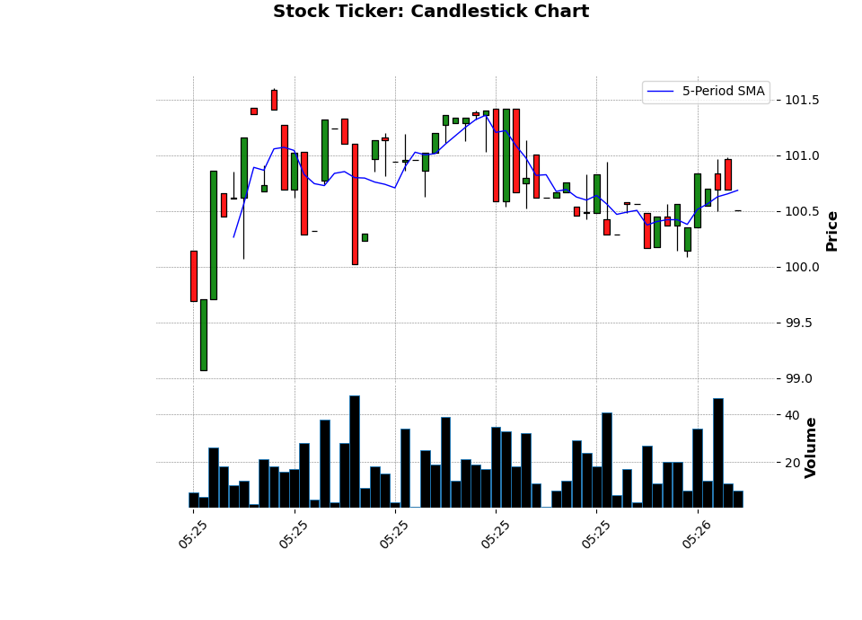
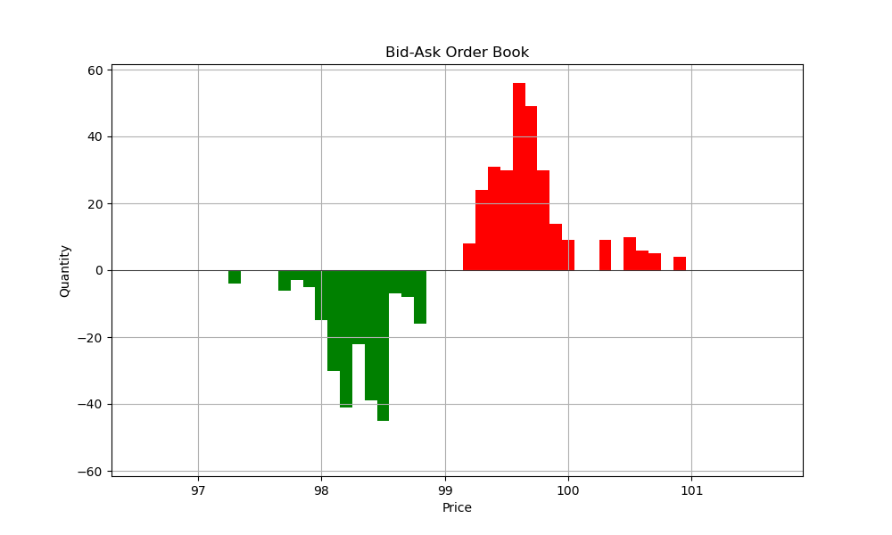

# Stock Exchange Simulator

This is a from-scratch stock exchange simulator which I'm building to understand how it all works.

## How Works

It consists of:

- `OrderBook` class which acts as a Limit Order Book (LOB) matching engine
- `OrderServer` websocket server that listens to connections and relays orders to the `OrderBook`
- `MarketDataServer` polls the `OrderBook` for udpates and sends the data to the subscribers
- `interactive_client.py` script allows user to enter orders in console and sends orders via websocket. Can launch multilpe instances of the program and trade with each other
- `Bloomberg` class which acts as a dashboard and visualizes market data in real time (No relation to the real Bloomberg Professional Service, this exists only for educational purposes)

## How to Run

To start the Stock Exchange simulator servers, run:

```bash
python3 /simulator/main.py
```

Launch as many clients imitating traders. You can make them trade with each other:

```bash
python3 /simulator/interactive_client.py
```

Enter details about your order. Buy or sell side:

```shell
Connection opened
Enter order details (e.g., 'b' for buy, 's' for sell, 'q' to quit):
Side (b/s) or 'q' to quit: s
```

```shell
Limit price: 100
```

```shell
Quantity: 10
```

```shell
Sent order: {'side': 'sell', 'price': 100.0, 'quantity': 10}
```

If there was already a corresponding matching order, you will get a fill notification:

```shell
Server responded: [{'timestamp': 248554.055830083, 'buyer_id': 'bf2d88d4-4286-4f99-9ff3-6237ab9c685e', 'seller_id': 'dc2d7bb0-21fc-479a-bf9d-6b6255ca9971', 'price': 100.0, 'quantity': 5}]
```

Here, only 5 shares got filled, and the other 5 are still in the order book.

## Later

In the future I will create different types of counterparties like market makers, market movers and just random noise (sorry retail traders) to do some sandbox Quant research.

Currently the system is written in python and relies on `asyncio` and `websockets`. Eventually I'd like to make all the components into independent processes written in modern `c++`.

## Sample Output

Below are some figures generated by the prototype scripts which contain the order book and the counterparties all in the same file using events. This is not the main simulator.

Figure generated at the end of the simulation showing candle sticks.



Real-time order book showing bids and asks as bars.


